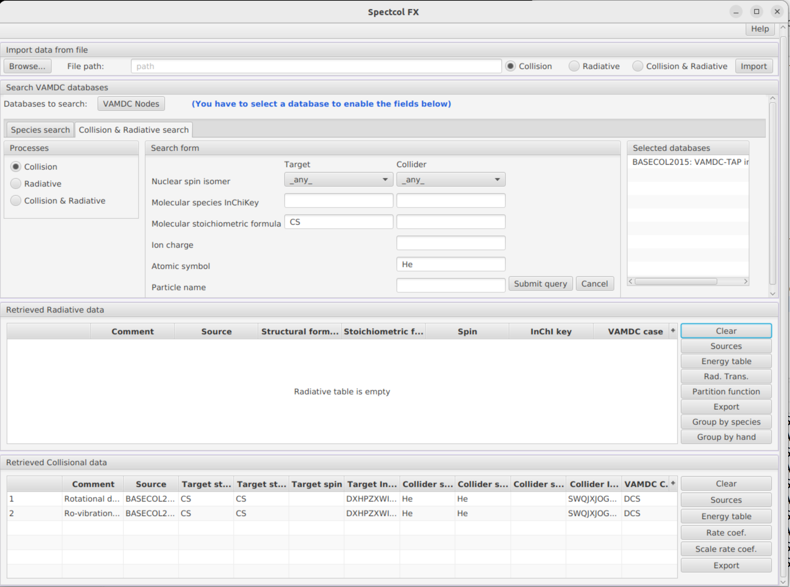
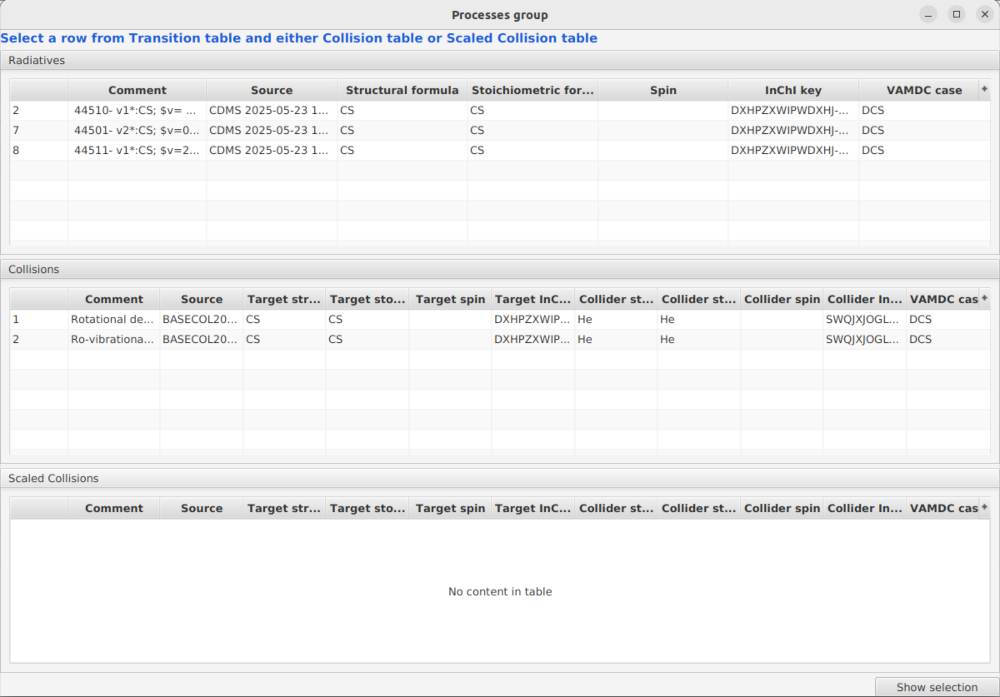

.. _spectcol

The SPECTCOL client tool
========================

Presentation
------------

Spectcol is a tool dedicated to handling XSAMS formatted data for the purpose of extracting and merging Einstein and rate coefficients from different sources.

Spectcol is an executable software, developed in Java language. 
The document gives a help on Spectcol's functionality and how to use it. Several versions have been developed since the beginning of the project, but the latest version is the "2502_r1".

This application has a direct access to data from 4 databases : 

- `Basecol <https://basecol.vamdc.org>`_
- `CDMS <https://cdms.astro.uni-koeln.de>`_
- `JPL Molecular Spectroscopy <https://spec.jpl.nasa.gov/>`_
- `Hitran <http://www.cfa.harvard.edu/hitran/>`_

Task 1: Discovering database species
------------------------------------

When the application launches, the main window appears.  
If this is the first time you are launching the application or if you have installed a new version, you must first accept the terms and conditions before the main window opens.

**Main window:**

For this first task we will use the "Search VAMDC databases" section. It enables users to select the relevant databases and to perform the queries on the selected databases.
The databases must be selected before the queries forms are used. Though all VAMDC-connected databases are reachable, only CDMS, JPL, HITRAN and BASECOL are allowed for queries.

**Expected result:**

Then we will use the "Species Search" tab, it is selected by default at startup.
It allows the user to retrieve species information from the selected databases.

There are 6 query parameters. The only "exotic" one is the molecular species InChiKey. 
The InChI identifier describes chemical substances in terms of layers of information — the atoms and their bond connectivity, tautomeric information, isotope information, stereochemistry, and electronic charge information.
It is human readable.

The InChIKey is a 25 characters long hash of an InChI identifier and as such is not human readable. 
It is used in VAMDC species database as an unique identifier for species.

Let's look for available isotope related to the CS molecule in the BASECOL and CDMS database.
Verify that these two databases are the only checked one.  
You will notice that each time you select a database, the "Selected databases" box on the right side, updates accordingly, displaying the currently selected databases.
Then, in the "Molecular Stoichiometric Formula" field, enter "CS".

**Expected result:**

   
Task 2 : Collision and Radiative search
---------------------------------------

In this task, we will search for collisional and radiative data. Click on the "Collision & Radiative search" tab.
On the left side, you will notice three radio buttons that allow the user to:
- Perform a radiative search,
- Perform a collision search,
- Perform both searches simultaneously.

If you choose Radiative, make sure that only spectroscopic databases (CDMS, JPL or HITRAN) are active.
If you choose Collision, ensure that only Basecol is active.
Otherwise, you will receive multiple pop-up warnings informing you that the search has failed.

**Task 2.1 : Radiative search**

Once again we will look for data available for the CS molecule. Check the CDMS database and indicate "CS" as "Molecular stoichiometric formula".
Submit query (and wait for a little while as it can take some time).
Sometimes, there is too much data, causing the request to fail. In such cases, you need to apply additional constraints by filling in the other fields.

**Expected Result:**

    
All the available datasets appeared in the table. Thanks to the buttons on the right, it is possible to display all the informations related to the currently selected dataset :

- Sources (list of all publications related to those data )
- Energy tables ( list of levels )
- Radiative Transitions (list of transitions and values of Einstein coefficients)
- Partition function ( values of partition function for different temperatures)

Take some time to try all those functionnalities. All those informations can be saved as csv files. Informations related to data sources can be exported as bibtex too.

Under the partition function button is the "Export" button. It allows the user to export the data of a dataset either as an XSAMS file or in `the RADEX format <https://home.strw.leidenuniv.nl/~moldata/radex.html>`_.
Select the data for the file labelled 48503 and export it as "Radex for LTE".

**Expected result:**

    
This file can be used directly to calculate line intensities in interstellar clouds under LTE conditions.

**Task 2.2 : Collisional search**

We are now back in the "Search VAMDC databases" area, where we will search for collisional data. Click on the "VAMDC Nodes" button and select "BASECOL".

Next, go to the "Collision & Radiative search" tab, select the "Collision" radio button, and proceed with the query.
To find a dataset, you can specify criteria for both the target and the collider of the collision. We will search for CS data so that we can later combine the results with radiative data.

For now, let's retrieve all available data. Simply enter "CS" in the "Molecular stoichiometric formula" field.

**Expected result :**

    
We can do a more precise request, by specifying the colliding species. For example we could look for data implying a CS + He collision. 
Enter "He" in the Atomic symbol field. There should only be **2** available collisions.

**Expected result :**

Once again, for each dataset, it is possible to display and export the data it contains as a CSV file :

- Sources
- Energy table of both target and collider
- Rate coefficients
- Whole file as XSAMS file 
    
Task 3 : Grouping data
----------------------

A very convenient feature of this application is the possibility to merge data from Basecol and from a spectroscopic database.
The software will identify equivalent levels in energy tables according to their quantum numbers. 
Then it will produce a table containing levels existing in both tables, using energy values from the spectroscopic database.
Finally, it will give rate and Einstein coefficients for the levels available after merging the tables. 

The first thing to do is looking for CS data available in spectroscopic databases. We did that in task 2.1. Secondly, we have to look for CS by He collisions, as we did in task 2.2.

**Expected result :**

The "Group by hand" and "Group by species" buttons can be used for merging. The former will let the user choose manually which datasets he wants to merge. The latter will search in the collision datasets the ones whose collider corresponds to the currently selected transitions dataset.

The link between species will be performed thanks to the InChIKey value.

Click on the radiative dataset labelled **"47501"**, then click on "Group by species". A window will appear with no corresponding collisional set. Indeed none of them uses the same InChIKey, which means it is 
a different **CS** isotope.

Now select the dataset labelled **44501**. There are now **2** corresponding datasets.

**Expected result :**

    
You will notice that all the radiative datasets with a similar InChIKey have been selected as well.

Now we can merge data. You have to select one radiative and one collisional dataset and click on "Show selection". 
We will use the dataset labelled **44501** in CDMS, with v=0-4. These rotational data corresponds to those found in the Basecol datasets labelled **"Rotational de-excitation of  CS by He"**.
The merging can be made on one among the three Basecol datasets.

A new window will show the energy tables for the radiative set and the collisional set where you can choose the quantum numbers.

    
You will be able to choose manually which quantum numbers will be used to identify similar levels in each table. 

You can click on one or several columns to choose the quantum numbers. Here we will choose the rotational quantum number J and v.

The result is a new energy table containing levels available in both original tables. All related informations are provided too (Einstein and rate coefficients, sources values).
You have multiple export functionnalities so that you can use those merged data easily.

**Expected result :**

