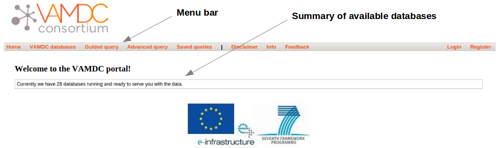
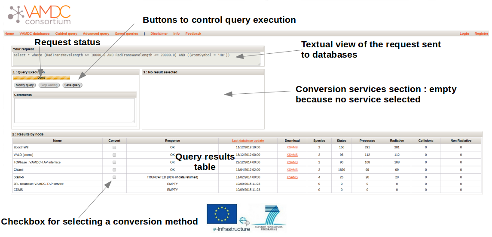

.. raw:: html

    
    
.. _user-guide-portal

.. role:: red

========================
User guide for portal
========================

Introduction
============

This document is compiled to familiarise yourself with the VAMDC portal interface.  If you are not sure what the portal is and whether you should be using it, click here(Mettre le FAQ). 

If you believe there is a mistake in this user guide or are having problems with the portal, please send an email to support@vamdc.eu

Below is a summary of the menu options displayed on the navigation bar.

Home
====

The portal entry page.

   
The home page of the portal acts as an entry point and displays the current number of available databases.

VAMDC Databases
===============

Displays a detailed table of the available databases.

   
The VAMDC databases page presents a table of the databases that are currently available through the portal; this information is provided by the VAMDC :ref:`Registry <registry>`. The columns of the table are as follows: 

Name
    The name of the database, often appended with the interface type presented to the portal e.g. :ref:`VAMDC-TAP <vamdc-tap>`. Clicking on the name of the database will take you to an external web page that contains information about the database such as a detailed description of the data it contains. 

Description 
    A brief description of the data held in the database. A more detailed description may be found by clicking the database name. 

Maintainer 
    The most recently provided email address of the person maintaining the VAMDC interface to the database. If you have any questions regarding the interface or the database, please send an email to this address. 
    
Status 
    The last recorded status of the database. Most of these VAMDC databases are not co-located with the portal so the availability of the portal does not guarantee availability of all of the databases. This column provides an indication of the status of the database; a value of OK means that the database is available and should respond to queries although be aware that the status of the database may have changed since it was last checked by the portal. 
    
Available species
    Display in a page a list of all species available in the database by clicking on « show » link.Molecules and atoms are displayed in a separated table.
    

   
Query
=====

Queries are constructed and submitted from this page. When a query has been submitted, you will be taken to the :ref:`Query Results <query-result>` page. 

   
The query page is used to build and submit queries to the database nodes. The portal uses the information available to it (from the :ref:`VAMDC Registry <registry>`_) to make sure that you cannot submit a query to a database node that does not support a particular keyword e.g. only databases that support searches on the "AtomSymbol" keyword will receive the query from the portal. Once a query has been constructed, it can be submitted to those supporting nodes using the "Find Data" button and the results will be displayed on the separate :ref:`Query Results <query-result>` page.

:red:`Query Menu`
-----------------

The query menu provides a list of grouped keywords from which to build your query; moving your mouse over the menu items will reveal the grouped keywords (e.g. atom, molecule, particle) and clicking on one will add it to the query building space. You can add as many groups of keywords as you like, including the same grouping more than once e.g. you could select the atom group of keywords more than once if you wanted to query more than one atom. Below is a list of the available keyword groups, with a brief description where necessary. 

* Species

  * Atom
  
  * Molecule
  
  * Particle
  
* Processes

  * Radiative 
  
  * Collision 
 
* Environment - includes the keywords of Temperature, Pressure and Number Density. 

* Advanced - these are not keyword groups but they do provide advanced functionality. 

  * Util (From release 12.07) - Provides a couple of extra tools for your query such as searching by "source doi" and, replicating an earlier query by not returning additions and modifications made after a provided date (only supported by some databases). 
  
  * Query editor - Allows you edit the textual form of the query which will be sent to the VAMDC databases. The query language is a modified form of :ref:`SQL <sql>`; more details can be found at http://standards.vamdc.org/queryLanguage/index.html. 
  
  * Request - Allows you to select or deselect which data (or requestables) will be returned by your query (note that most services do not support this feature). The blue disks indicate that the data has been selected and will be returned while the black disks mean that the data will not be returned; clicking the words will select or de-select the requestable. Note that selecting some requestables will result in others being selected/de-selected. 
  
  * Comments - Allows you to add comments to your query. These will not affect the query itself but can be useful if you decide to save multiple queries. 
  
:red:`Query Building Space`
---------------------------

The query building space is where your keyword groups will appear when you select them from the query menu; when you first view the query page it will be blank. Each keyword group will appear as a small form, the screenshot below shows an example with the important features annotated. 

   
Entering a value/text into a keyword field will enable it in your query; some keyword fields (such as "Chemical Name" in the Molecule keyword group) have auto-complete drop down lists.
    
:red:`Database node tree`
-------------------------

The database node tree provides a detailed tree-based view of the query keywords supported by each database and provides an indication of which databases will support your current query. Moving your mouse cursor over any database name in the tree will show a small text box with the description of that database. You can expand the "node tree" for any database by clicking the triangle at the beginning of the corresponding line. This will show you a list of the keywords supported by that database and moving your mouse cursor over any of the keywords will show you a brief description of that keyword. 

Initially all of the databases entries will appear black. When you enter a value into a keyword field you will see that some databases will turn green meaning that those databases support a search on that particular keyword. If you enter values into subsequent keyword fields and see a database turn red, it means that the database does not support all of the keywords of your search and will not be included in the query. 

Below is an annotated screenshot of the node tree. 

   
:red:`Submitting and saving your queries`
-----------------------------------------

The "Find Data" button is used to submit your query and take you to the query results page. If your query is not valid then the button will appear ghosted and will be non-functioning (as is the case on first visiting the page). Once you have constructed a valid query, the button will become usable. 
The "Save Query" button is used to save the query that you have constructed - see :ref:`Saved Queries <saved-queries>` for further information. Unless you are logged in (see :ref:`Login and Register <login-register>`), your saved queries will only persist for your current browser session. 

Query Results
=============

.. _query-result:

   
The query results page appears after the "Find Data" button is pressed on the query page. A description of the components follows.

:red:`Query status`
-------------------

The query status is a progress bar showing the current status of the query. When the query is in the process of running, it will indicate the number of database nodes which have responded so far.

:red:`Query control buttons`
----------------------------

The query control buttons enable you to: 

* Modify query - stops the currently running query and takes you back to the query building page. 

* Stop waiting - stops the current query from running rather than waiting for the remaining nodes to send a response. 

* Save query - as on the query building page, enables you to save the current query. This is unavailable while the query is running. 

:red:`Textual view of query`
----------------------------

This is the textual form of the query that you built on the query building page. It is in the VAMDC query language which is based on :ref:`SQL <sql>`. 

:red:`Query comments form`
--------------------------

Enables you to add comments to your query which can be useful if you decide to save it. If you have added a comment to the query on the query building page, it will appear here. 

:red:`Query results table`
--------------------------

The query results table displays a summary of the data returned by each VAMDC database node after receiving the query that you built; each row in the table represents a response from a specific node. The portal does not directly receive the data from each node that matches your query, instead it receives a summary of the matching data and a web link (URL) to that data which is subsequently displayed on this table. A description of the table columns follows: 

Name 
    The name of the database node that sent the response.  
Convert
    The convert is a check-box used to select data to be sent to the conversion.
Response 
    The response indicate the status of the database node. Normally one will see 'OK' regardless of whether the database has any data applicable to your query. If your query matches a lot of data at a particular node, you may see the status as "Truncated" and a percentage of data available. In parenthesis, you get the date of last update of the database.
Download 
    If your query matches data at a node then there will be a link in this column (hosted by the node itself) to an :ref:`XSAMS <xsams>` formatted file containing your data (please see the glossary link for more information on the XSAMS format). If you do not have any experience with the XSAMS format, you may find the :ref:`Conversion services <conversion-services>` useful. 
Species, States, Processes, Radiative, Collisions, Non Radiative 
    These columns summarise the results of your query on each individual database node.

.. _conversion-services:

:red:`Conversion services`
--------------------------

XSAMS is an advanced XML based format that manages to provide a description of atomic and molecular data between very different data sources. For these reasons, it is not well suited to be displayed directly in a web browser. The Conversion services can take the XSAMS data from database node (the result of a query) and present it to you in a more immediately convenient format e.g. a series of tables.

To send one of more query responses to an Conversion service, click the related check-box (so that a tick appears). A list of conversion services will appear (entries starting with ** are recommended for the selected data), select the conversion service that you want to use from the available list (e.g. "Table Views of XSAMS" will present the data to you as a series of web page based tables) and click "Process". After a short period of time (depending on the size of the data set and how busy the service is) you should see a link that says "Result" - click this link to see the results of the processing. 

See the screenshot below for an annotated screenshot of the Conversion services. 

Info
====

This page provides details on how to get help/support. Clicking this button will display a page with a link to these user guide and tutorial pages. (à changer par Nicolas)

Feedback
========

Clicking this button will take you to the `VAMDC forum <http://forum.vamdc.org/>`_ website which lists all topics related to the portal

.. _login-register:

Login and Register
==================

Registration is not required but doing so enables persistent query history between sessions and email updates. 
You only need to register and login if you wish for your saved queries to be persistent between browser sessions.
To register for an account, click on the "Register" link on the navigation bar, fill in the details and click the "register" button.
To login, click on the "Login" link on the navigation bar and enter your details; selecting the "Remember Me" check-box will ensure that your login details are store in your browser so you do not have to re-enter them. 